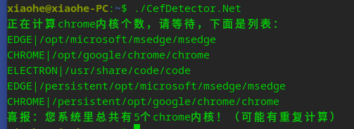
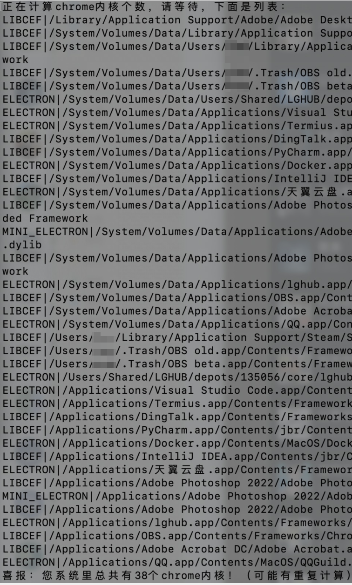

# CefDetector.Net - 检测你系统中包含多少个 Chromium 内核程序

Check how many CEFs are on your Windows/Linux/MacOS.

看看你系统 **(Windows/Linux/MacOS)** 上有多少个 [CEF (Chromium Embedded Framework)](https://bitbucket.org/chromiumembedded/cef/).

目前没有特别完善，可能还有很多情况没考虑到，欢迎发 issue ！

（测试系统：Windows 11 专业版、Deepin 23 Alpha、Apple Silicon MacOS；Deepin上浏览器会存在重复检测的情况，看截图你就懂了）

（也许可以起一个 Web 服务然后展示“喜报“，以后再说啦）

> 目前支持Windows/Linux/MacOS，其他系统若有需要支持请提交 issue 。

## 截屏

### Deepin：

### Macos:

## 使用

从 [Release](https://github.com/xh321/CefDetector.Net/releases) 页面下载最新的压缩包, 解压后给予 `CefDetector.Net` 执行权限后运行即可.

### MacOS 用户请注意：

你需要预先安装好`.Net 7`运行库（https://dot.net)，然后使用`dotnet CefDetector.Net.dll`来执行本程序。
之后试试能不能生成不需要运行库的版本。
下载链接：
[ARM64版本运行库(苹果芯片)](https://dotnet.microsoft.com/en-us/download/dotnet/thank-you/runtime-7.0.0-macos-arm64-installer)
[X64版本运行库(Intel芯片)](https://dotnet.microsoft.com/en-us/download/dotnet/thank-you/runtime-7.0.0-macos-x64-installer)

## 特性

- 检测 CEF 的类型: 如 [JCEF](https://github.com/JetBrains/jcef)、[libcef](https://bitbucket.org/chromiumembedded/cef/src/master/)、[Electron](https://www.electronjs.org/)、[NWJS](https://nwjs.io/)、[CefSharp](http://cefsharp.github.io/)、[Edge](https://www.microsoft.com/en-us/edge) 和 [Chrome](https://www.google.com/chrome/)
- 计算总数量
- 相比原版来说，原版在统计某些CEF框架时存在问题，例如Epic游戏启动器，可执行文件在上两级目录，原版把每一个资源文件夹都算作独立的CEF，这是不合理的；同时，JCEF（例如JetBrains全家桶使用的）目前暂时不知道特征，只能暂时用jrt-fs.jar作为特征。

## 作者

xh321

创意来自 @ShirasawaSama 的 [CefDetector](https://github.com/ShirasawaSama/CefDetector) 项目。由于这个项目没有跨平台，所以我花一下午搓了一个功能差不多的。

## 协议

[MIT](./LICENSE)